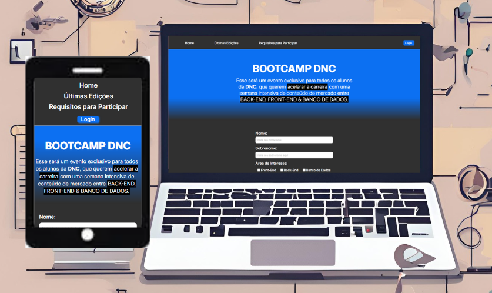
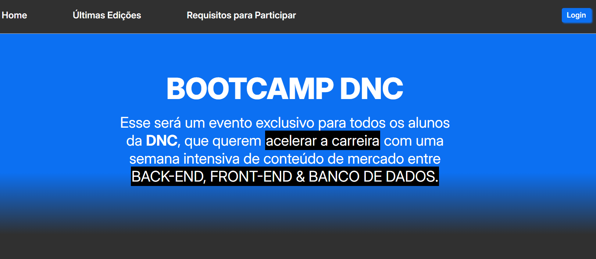
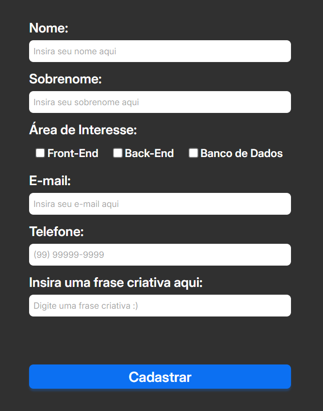
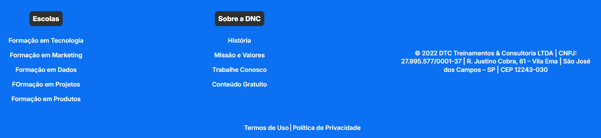
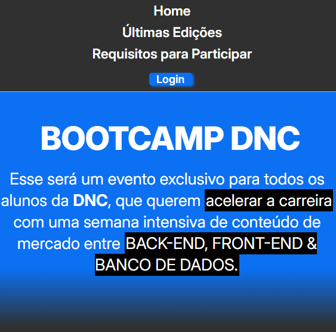
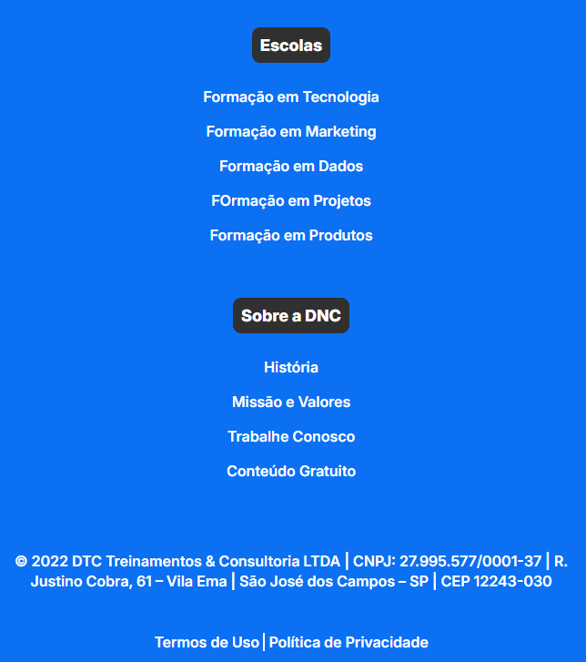

<p align="center">
    
</p>
<p align="center">Preview <b>Bootcamp DNC</b></p>

# 💻 Landing Page - Bootcamp DNC 💻
🤓 Bem-vindo a mais um **`projeto prático`**. Este projeto foi criado para aplicar os conceitos de **`front-end`** aprendidos durante as aulas na [Escola DNC](https://www.escoladnc.com.br/). Ele combina um design moderno e `responsivo` com uma estrutura simples e eficiente, focando na experiência do usuário ao realizar um cadastro para um bootcamp. 📝


## 📝 Descrição
O contexto da pagina **`Bootcamp DNC`** seria para capturar os iteresses dos usuários e incentivá-los a se inscrever em um bootcamp. Com um layout limpo e design adaptável a diferentes tamanhos de telas.

## 🎯 Para que serve?
O principal objetivo desta página é servir para a prática dos conceitos **`front-end`**. Montagen e organização do `HTML` e estilização e responsividade com `CSS`.

## 👀 Demonstração
Quer dar uma espiadinha na página? Confira a versão clicando [aqui](https://luizvictorino.github.io/bootcamp-DNC/)! Veja como ela se adapta a diferentes dispositivos e oferece uma navegação suave e agradável. 🌐

## 💡 Funcionalidades
* `Design Responsivo`: Ajusta-se perfeitamente a qualquer dispositivo, garantindo uma ótima experiência visual.
* `Menu de Navegação`: Facilita o acesso às diferentes seções da página.
* `Formulário de Inscrição`: Simples e direto, permite que os usuários se cadastrem rapidamente.
* `Seções Informativas`: Estrutura clara com informações organizadas de maneira acessível.

## 🛠️ Tecnologias Utilizadas
Este projeto foi desenvolvido com as seguintes tecnologias:

* 🌐 `HTML5`: Estrutura semântica e organizada.
* 🎨 `CSS3`: Estilos e layout.

## Estrutura do Projeto
```
bootcamp-DNC/
├── images/
│   ├── layout/             # Imegens principais do projeto
│   ├── layout-responsive/  # Imagem responsiva do projeto
│
├── index.html              # Estrutura principal da página
├── style.css               # Estilos da página
├── README.md               # Arquivo de documentação
```

## 📸 Algumas Fotos do Projeto
Aqui estão algumas capturas de tela do projeto em diferentes dispositivos, mostrando como ele se comporta e se adapta:

### 🖥️ Versão Desktop
<p>
     &nbsp;
    &nbsp;
    &nbsp;
</p>

### 📱 Versão Mobile
<p>
    &nbsp;
    &nbsp;
    &nbsp;
</p>

## 📬 Me Dá Um Alô!
Gostou do projeto? Tem alguma sugestão ou quer bater um papo sobre tecnologia? Me encontra no [LinkedIn](https://www.linkedin.com/in/luiz-victorino/) e vamos conversar!

## 🫱🫲 Contribuição
Contribuições são bem-vindas! Sinta-se à vontade para abrir issues ou enviar pull requests para melhorias e correções.

## 👨‍💻 Expert

<p>
    
    <p>&nbsp&nbsp&nbsp <b>Luiz Victorino</b><br>&nbsp&nbsp&nbsp
    <a href="https://github.com/luizvictorino" target="_blank">GitHub</a>
    &nbsp;|&nbsp;
    <a href="https://www.linkedin.com/in/luiz-victorino/" target="_blank">Linkedin</a>
</p>

_____________________________
<br>
